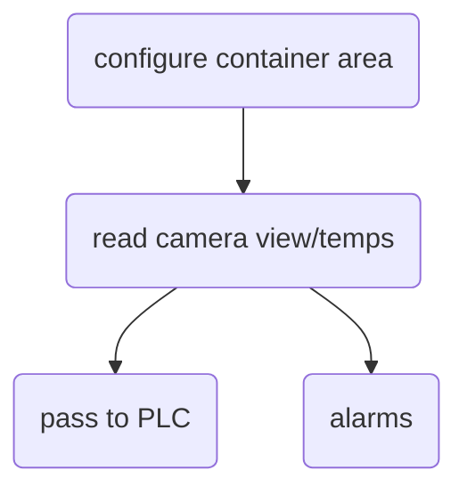
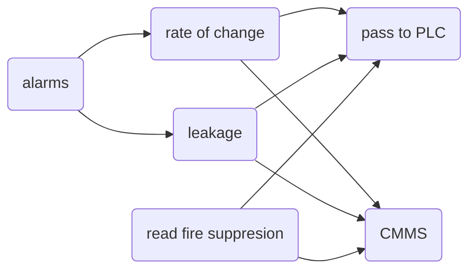

## Deliverables
---
* Design document
* Test documentation
	* loading dock FAT
	* dry creek SAT
	* production install
* configuration + setup guide

## Risks
---
* Thermal camera interference
* thermal view of container
* scope:
	* creep
	* low margin
* remote access
* working testing in/on dock
* connection to ABPLC

## Logic
---

